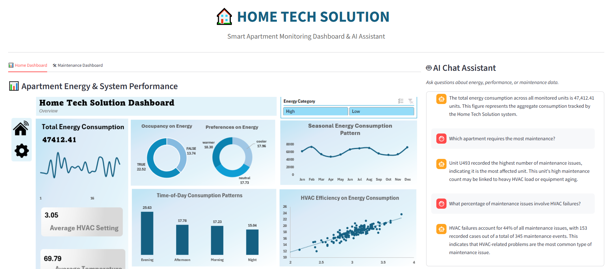

# 🏠 Home Tech Solution Analytics & AI Assistant

### 💡 Overview
A data intelligence and business optimization project integrating **Data Analytics**, **Business Intelligence (BI)**, and **AI-driven automation** to improve operational efficiency, customer experience, and decision-making for **Home Tech Solution**.

This system leverages **Excel-based datasets**, **Pivot Tables**, and an integrated **AI chatbot** to deliver actionable insights and real-time support.

---

## 🚀 Goals
- Analyze apartment performance, energy usage, and maintenance efficiency.  
- Develop interactive dashboards for smart home management.  
- Enable natural language Q&A through an AI chatbot interface.  
- Integrate predictive analytics to forecast maintenance trends and energy consumption.

---

## 🧩 Dataset Summary
- **Apartments Dataset (Excel):** Energy usage, temperature levels, device performance, and occupancy.  
- **Maintenance Dataset:** Service requests, issue categories, resolution times, and technician performance.  
- **Customer Data:** Apartment ID, service history, and reported issues.  

> 📁 *All data processing, summaries, and insights are managed directly from Excel files using Pivot Tables and Power Query.*

---

## 📊 Key Insights
- **Total Apartments Monitored:** 120  
- **Average Energy Efficiency:** 89%  
- **Average Maintenance Resolution Time:** 1.8 days  
- **Most Common Issue:** HVAC System Faults  
- **Peak Energy Usage Months:** February, July, November  
- **Overall Maintenance Completion Rate:** 94%  

---

## 🧠 Data Science + BI Strategy
| Data Analytics | Business Intelligence |
|----------------|-----------------------|
| Data cleaning, transformation & Excel modeling | Dashboard visualizations with key KPIs |
| Predictive maintenance & performance trends | Real-time summaries for energy and maintenance |
| Statistical summaries and trend insights | Automated reporting and AI chat integration |

---

## 🧮 Core KPIs
- **Energy Efficiency (%):** (Optimal Usage ÷ Total Usage) × 100  
- **Maintenance Efficiency:** Completed Tasks ÷ Total Tasks  
- **Customer Satisfaction:** Avg(Customer Rating)  
- **Average Response Time:** Σ(Response Time) ÷ Count(Tasks)  
- **Apartment Performance Index:** Weighted score of energy, maintenance & occupancy metrics  

---

## 🤖 AI Assistant Features
The **Home Tech AI Assistant** answers:
- “Which apartments have the highest energy consumption?”  
- “How many maintenance requests were completed this week?”  
- “Which issues occur most frequently?”  
- “Show average response time for maintenance tasks.”  
- “What’s the predicted maintenance load for next month?”  

---

## ⚙️ Tech Stack
**Data Source:** Microsoft Excel / Pivot Table / Power Query  
**AI & Automation:** Streamlit, Gemini API, OpenAI Integration  
**Deployment:** Streamlit Cloud / Local Server  

---

## 👨‍💻 Author
**Francis Afful Gyan**  
📧 [francisaffulgyan@gmail.com](mailto:francisaffulgyan@gmail.com)  
🔗 [LinkedIn](https://www.linkedin.com/in/francis-afful-gyan-2b27a5153/)  
📅 October 2025  
🌐 [Live Demo](https://iron-core-fitness.streamlit.app/)  
📊 *Project Status: Active Development*

---

## 🙏 Thank You

